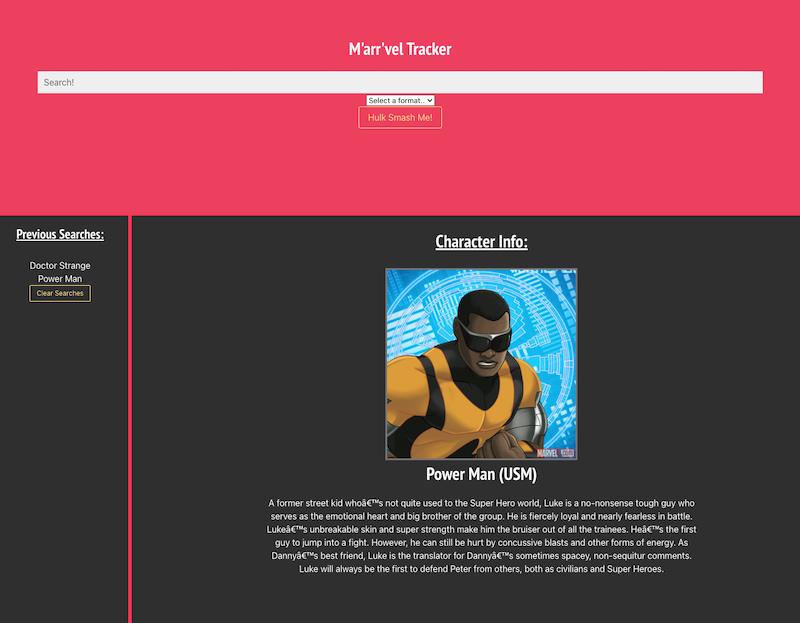

# Marvel Tracker "M-aaaar-vel"

A website for Marvel fans to stay updated about up and coming projects of their favorite characters, presented in a pirate-style summary.

- This project aims to retrieve information about upcoming Marvel projects using the Marvel API and present the information in a pirate-style summary using the OpenAI API.

A website that allows you to get an image of your favorite Marvel superhero, along with their description. This project highlights the use of API's as well as CSS frameworks to add features on the website. 

## Deployment Link

- Live Link: https://poochmagunder.github.io/Project-Marvel/
- Github URL: https://github.com/PoochMagunder/Project-Marvel

## Layout of Deployed Site

## Features

- Display information about your favorite Marvel characters

- Pirate-style summary of the information provided by Marvel API
- User-friendly interface to search for characters

- Image border properties that change color based on character eye colors
- User-friendly interface to search for characters
- Local storage to save character search history (with no duplicates)

## Prerequisites

- Marvel API Key: Sign up for an API key at https://developer.marvel.com/docs

- OpenAI API Key: Sign up for an API key at https://beta.openai.com/docs/

- Superhero API Key: Sign up for an API key at https://www.superheroapi.com/

## Installation

- Clone the repository to your local machine:
- Navigate to the project directory

## Built With

- HTML
- CSS
- Javascript

- Bulma
- JQuery
- JQueryUI
- CryptoJS
- Marvel API
- Open API

## Credits

Autocomplete 
https://www.w3schools.com/howto/howto_js_autocomplete.asp

Marvel Developer Portal
https://developer.marvel.com/docs#!/public/getCreatorCollection_get_0

Fetch API
https://developer.mozilla.org/en-US/docs/Web/API/Fetch_API/Using_Fetch

- JQuery
- JQueryUI
- CryptoJS
- Bulma
- Marvel API
- Open API
- Superhero API

## Credits

* Autocomplete:
https://www.w3schools.com/howto/howto_js_autocomplete.asp

* Marvel Developer Portal:
https://developer.marvel.com/docs#!/public/getCreatorCollection_get_0

* Fetch API:
https://developer.mozilla.org/en-US/docs/Web/API/Fetch_API/Using_Fetch

* Superhero API:
https://www.superheroapi.com/

## License

This project is licensed under the MIT License.
